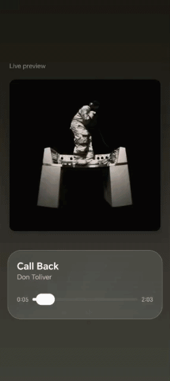
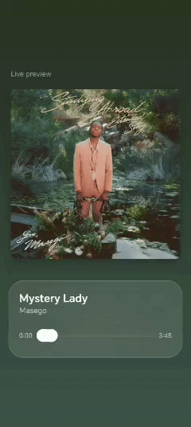

# Glass Widget Builder

Una app Android que se conecta en tiempo real a Spotify y muestra una
pantalla "Now Playing" con estética **Liquid Glass** (vidrio esmerilado
translúcido, estilo iOS) — con fondo dinámico que toma los colores de
la portada del álbum, animaciones fluidas de transición entre canciones,
y control de reproducción directo desde la app.

### Fondo dinámico con transición animada

### Thumb con efecto de vidrio real (Prismal)

## Qué hace

- **Autenticación real** con la cuenta de Spotify del usuario
- **Conexión en tiempo real** vía Spotify App Remote SDK (eventos push, sin polling)
- Muestra canción, artista y portada actuales, actualizados en vivo
- **Fondo dinámico**: extrae los colores dominantes de la portada (Palette API)
  y los aplica como degradado, con transición animada suave entre canciones
- **Control de reproducción**: arrastra la barra para saltar a cualquier punto
  de la canción, con debounce para no saturar la API de Spotify mientras arrastras
- **Thumb con efecto de vidrio real** (Prismal), renderizado con OpenGL
- **Soporte de orientación**: layout independiente para vertical y horizontal,
  con restauración de estado para no perder la conexión al girar el dispositivo
- **Modo inmersivo**: oculta las barras de sistema para una experiencia de
  pantalla completa
- Detección de cambio de canción real (por URI) para evitar animaciones
  repetidas al solo mover la barra de progreso

## Roadmap

- [ ] Selector de color/paleta manual para la tarjeta
- [ ] Controles de play/pause/siguiente desde la propia tarjeta
- [ ] Publicar la tarjeta como widget nativo de pantalla de inicio
  (`AppWidgetProvider` + servicio en segundo plano)

## Retos técnicos resueltos

### 1. Bloqueo de autenticación de Spotify en Android 14+

Durante la integración con el Spotify App Remote SDK, la conexión se quedaba
colgada indefinidamente sin disparar ni éxito ni error.

**Diagnóstico:** revisando Logcat, se encontró el mensaje `Background activity
launch blocked!` — parte del sistema BAL (Background Activity Launch) que
Android endurece desde la versión 14. El SDK de Spotify intenta abrir su
ventana de autorización desde un servicio en segundo plano, lo cual el
sistema operativo bloquea por seguridad.

Se confirmó que es un problema conocido del SDK revisando
[spotify/android-sdk#377](https://github.com/spotify/android-sdk/issues/377),
donde otro desarrollador reportó exactamente el mismo comportamiento.

**Solución:** en vez de depender del flujo de autenticación integrado en
App Remote (`showAuthView(true)`), se usa la librería `com.spotify.android:auth`
para abrir el login directamente desde la actividad en primer plano
(`AuthorizationClient.openLoginActivity`). Como el lanzamiento viene de una
interacción directa del usuario, Android no lo bloquea. Una vez se obtiene
el token, se conecta el App Remote pasando `showAuthView(false)`.

### 2. Parpadeo de UI al arrastrar la barra de progreso

Cada vez que se usa `seekTo()`, Spotify dispara múltiples actualizaciones de
`playerState` para la misma canción — provocando que la animación de cambio
de canción se disparara repetidamente sin necesidad, generando un parpadeo
visible en portada, título y artista.

**Solución:** se guarda el `track.uri` de la canción actualmente mostrada, y
la animación de transición solo se dispara si el URI cambió respecto al
anterior — un simple cambio de posición dentro de la misma canción ya no
re-anima nada.

### 3. Pérdida de conexión al girar la pantalla

Por defecto, Android destruye y recrea la Activity al cambiar de orientación,
lo que devolvía al usuario a la pantalla de "Conectar con Spotify" aunque la
sesión siguiera activa.

**Solución:** se usa `onSaveInstanceState`/`onCreate` para persistir el último
estado mostrado (canción, artista, portada) a través de la recreación de la
Activity, evitando que el usuario vea un "parpadeo" de vuelta a la pantalla
de login. El propio `onStart()` se encarga de restablecer la conexión real
con Spotify en segundo plano.

## Stack técnico

- **Kotlin**, Android SDK 31–36
- **Spotify App Remote SDK** (conexión y datos en tiempo real)
- **Spotify Auth Library** (autenticación)
- **Palette API** (extracción de color dominante de la portada)
- **Prismal** (efecto de vidrio real vía OpenGL para el thumb del slider)
- Gradle Kotlin DSL

## Configuración local

Este proyecto usa `local.properties` (no versionado) para tu Spotify Client ID: